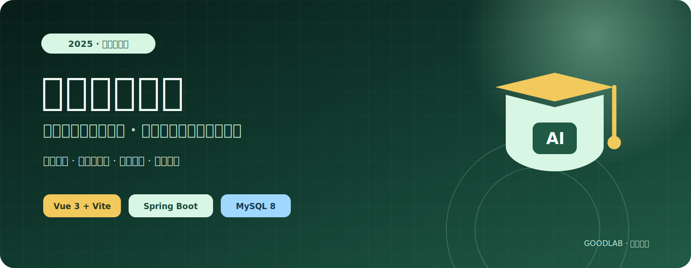
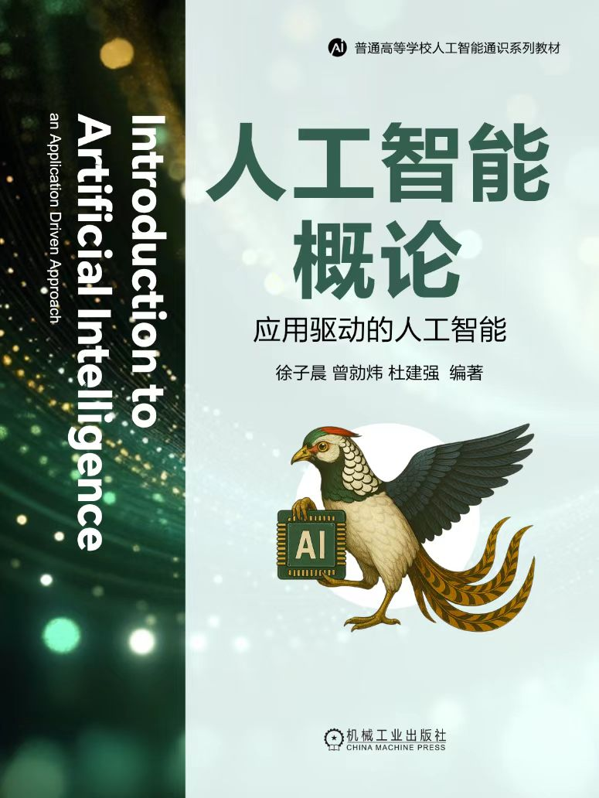
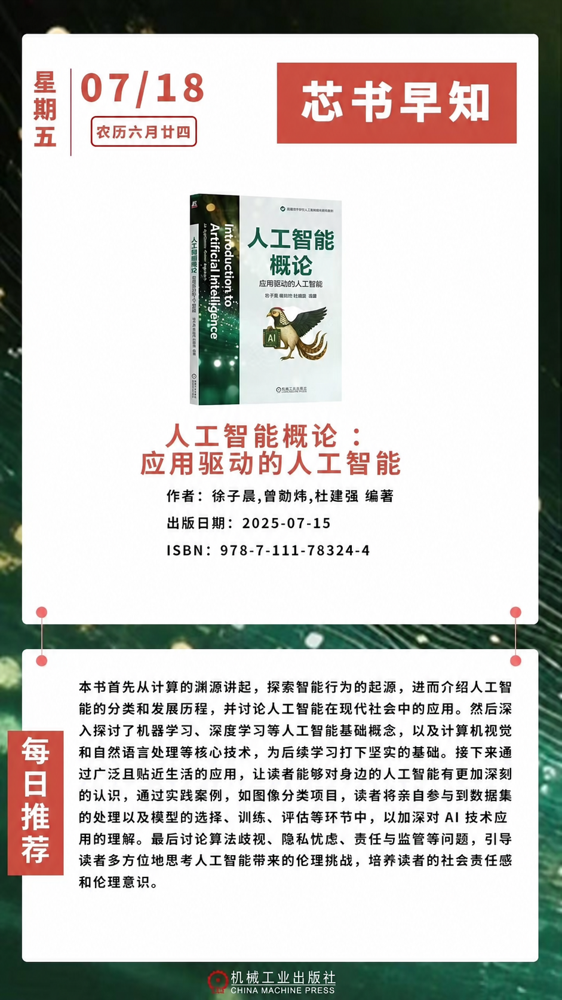
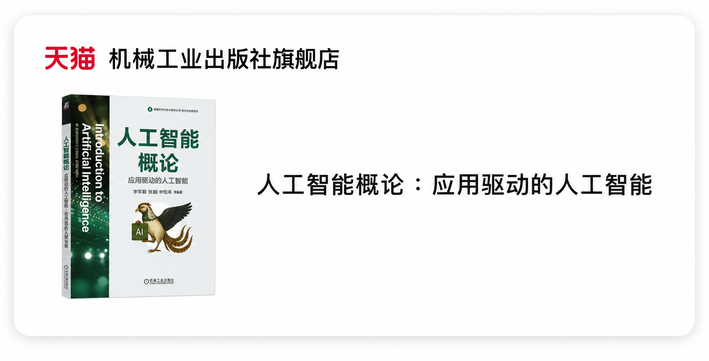
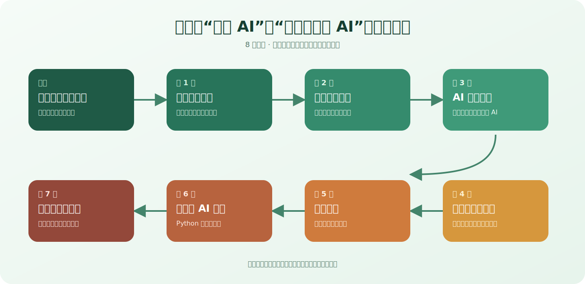
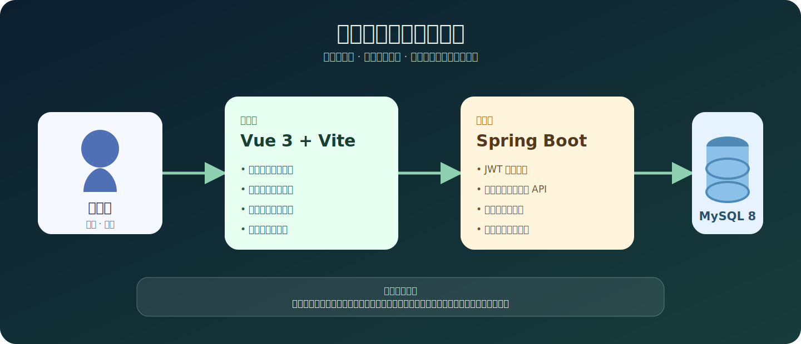

<p align="center">
  
</p>

# 《人工智能概论》数字化教材

这是 2025 年出版的《人工智能概论：应用驱动的人工智能》的配套数字化教材平台。项目把纸质教材的知识结构延伸为可浏览、可操作、可测验、可追踪的 Web 学习体验，帮助非人工智能专业的读者从生活案例出发，逐步理解机器学习、计算机视觉、生成式人工智能、提示工程、Python 项目与 AI 伦理。

> [!IMPORTANT]
> 正式数字平台仅向南昌大学及本书官方授权学校的师生开放。学生账号为对应学号；本仓库不包含真实账号、名册、密码、成绩或生产环境配置。

## 教材与项目状态

- **教材**：《人工智能概论：应用驱动的人工智能》
- **出版时间**：2025 年
- **编著**：徐子晨、曾勋炜、杜建强
- **出版社**：机械工业出版社
- **当前仓库**：第一版教材的数字化平台代码
- **第二版**：即将上市，对应仓库为 [Nanqipro/AI_Book_Revision_2026](https://github.com/Nanqipro/AI_Book_Revision_2026)

第二版的定位是：**一本写给广泛读者的、关于当下 AI Agent 应用的通识教程。**

<p align="center">
  
</p>

## 新书发布与购买

《人工智能概论：应用驱动的人工智能》已于 2025 年 7 月出版，ISBN 为 `978-7-111-78324-4`。下图为新书发布海报与机械工业出版社旗舰店的商品信息预览。

<p align="center">
  
</p>

<p align="center">
  <a href="https://item.taobao.com/item.htm?id=1067141988036">
    
  </a>
</p>

<p align="center">
  <a href="https://item.taobao.com/item.htm?id=1067141988036"><strong>前往淘宝购买本书</strong></a>
</p>

> [!NOTE]
> README 使用的是公开发布专用衍生图：发布海报已移除二维码，商品预览已移除订单号、支付金额、退款状态等交易信息；原始订单截图未加入仓库。商品价格与库存请以销售页面实时信息为准。

## 从纸书到交互学习

仓库不是教材 PDF 的简单搬运，而是围绕学习过程组织的一套全栈应用：

- 以序章和 7 个主题章节组织学习路径；
- 用图片、音频、视频与交互组件解释抽象概念；
- 提供回归、深度学习、计算机视觉和神经网络可视化案例；
- 支持章节测验、得分统计、学习记录、等级与成就；
- 提供问题反馈、题库管理和管理员工作台；
- 同时适配桌面端、平板与移动端界面。

<p align="center">
  
</p>

更细的章节标题与知识点见 [docs/chapter-structure.md](docs/chapter-structure.md)。

## 平台中可以体验什么

### 认识与辨别 AI

第一章通过真实素材与 AI 生成素材的对比，让读者从图像、音频和视频中观察生成式人工智能的特征，并结合图灵测试、中文屋和人工智能发展史建立基础认知。

### 看见算法如何工作

第二、三章包含回归演示、卷积层与池化层动画、像素数据、边缘检测、目标检测、图像分割和目标跟踪等案例，把模型输入、特征与输出放到可视化界面中。

### 从生活场景理解应用

第四章围绕智能家居、智能驾驶、医疗和数字娱乐展示 AI 的应用边界；第六章进一步把 Python 基础、网络结构和训练日志组织成项目式学习体验。

### 形成学习闭环

平台提供章节测验、统计、排行榜、个人中心、学习成就和问题反馈。师生正式使用时由授权学校配置账号及教学数据，公开仓库只保留通用代码与非个人化示例内容。

## 技术架构

<p align="center">
  
</p>

- **前端**：Vue 3、Vite、Vue Router、Element Plus、ECharts、Chart.js、Plotly、Three.js、CodeMirror
- **后端**：Java 17、Spring Boot、MyBatis、MySQL、JWT
- **内容资源**：项目内图片、SVG、音频和视频，按章节存放于 `client/public/`
- **认证安全**：授权账号登录、基于角色的管理员鉴权、带盐 PBKDF2 密码摘要；历史 MD5 摘要仅在成功登录后迁移

## 本地开发

### 仅运行前端

适合查看登录页、组件代码和构建结果。完整章节数据、账号和学习记录仍需要后端服务。

```bash
cd client
npm ci
npm run dev
```

默认地址为 `http://127.0.0.1:5173`。生产构建命令：

```bash
npm run build
```

环境要求：Node.js 18 或更高版本。

### 运行完整开发栈

需要 Java 17、Maven 3.9+、Docker 与 Docker Compose。

1. 创建只供本机使用的环境文件并填写强随机值：

   ```bash
   cp .env.example .env
   ```

2. 启动 MySQL：

   ```bash
   docker compose up -d mysql
   ```

3. 在当前终端加载环境变量并启动后端：

   ```bash
   set -a
   source .env
   set +a
   cd server
   mvn spring-boot:run
   ```

4. 在另一个终端启动前端：

   ```bash
   cd client
   npm ci
   npm run dev
   ```

后端默认运行在 `http://localhost:8082`。数据库初始化脚本位于 `infra/mysql/`，包含通用表结构与非个人化示例题目，不创建默认管理员或学生账号。

> [!NOTE]
> 正式账号由授权学校在私有运维流程中配置。请勿把真实学号名单、默认密码、邮件凭据、JWT 密钥、成绩表或生产数据库导出加入公开仓库。

## 仓库结构

```text
.
├── client/                 # Vue 3 数字教材前端
│   ├── public/             # 按章节归档的图片、音频、视频与本地依赖
│   └── src/                # 页面、交互组件、路由、状态与 API 客户端
├── server/                 # Spring Boot / MyBatis 后端
│   └── src/                # 控制器、服务、拦截器、模型与资源配置
├── infra/mysql/            # 可公开复现的数据库结构与示例题目
├── docs/                   # 章节说明与 README 视觉素材
│   └── readme-assets/
├── .env.example            # 不含密钥的环境变量模板
└── docker-compose.yml      # 本地 MySQL 开发服务
```

## 教材、平台与第二版

- [购买《人工智能概论》](https://item.taobao.com/item.htm?id=1067141988036)
- [访问数字教材平台](https://szjc.ncu.edu.cn/) — 仅南昌大学及官方授权学校师生可登录
- [第二版配套仓库：AI_Book_Revision_2026](https://github.com/Nanqipro/AI_Book_Revision_2026)
- [GoodLab 团队](https://good.ncu.edu.cn/)

## 安全与隐私

公开版本有意排除以下内容：

- 学生名单、成绩表、用户头像与真实反馈数据；
- 初始密码规则、批量账号脚本、数据库导出与管理员凭据；
- 服务器地址、证书路径、反向代理实机配置和内部漏洞报告；
- 商业教材完整 PDF、LaTeX 源稿及未经确认可再分发的出版素材；
- 本地 `.env`、IDE、agent 配置、日志、构建产物与缓存。

发现安全问题时，请不要在公开 Issue 中粘贴账号、令牌、学号、日志或漏洞利用细节，处理方式见 [SECURITY.md](SECURITY.md)。

## 参与贡献

欢迎提交与公开代码有关的缺陷复现、可访问性改进和教学交互建议。提交前请阅读 [CONTRIBUTING.md](CONTRIBUTING.md)，并确保示例数据完全匿名、素材具备公开再分发权限。

## 版权与许可

本仓库当前没有授予统一的开源或开放内容许可。除第三方依赖及其各自许可证外，代码、教材文字、图片、音视频与出版相关内容的复制、修改、教学分发或商业使用，均需取得相应权利人的明确授权。

仓库“公开可见”不等于“可自由使用”。如需教材采用、学校授权或内容合作，请通过 GoodLab 或项目维护者联系。
