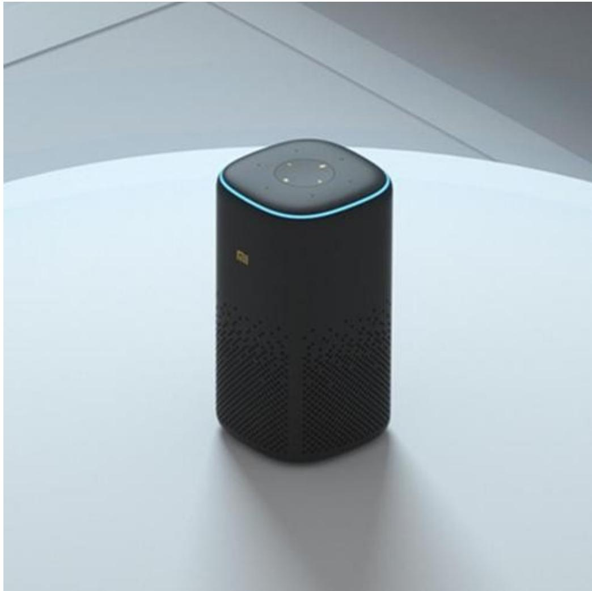
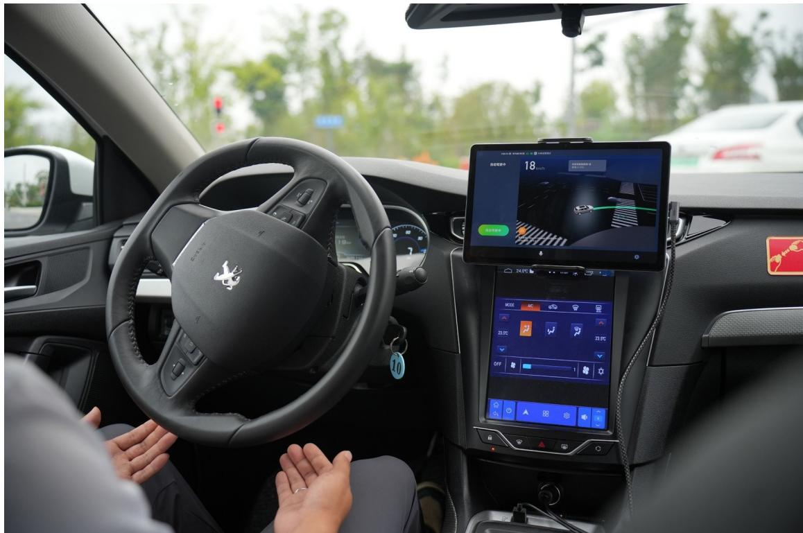
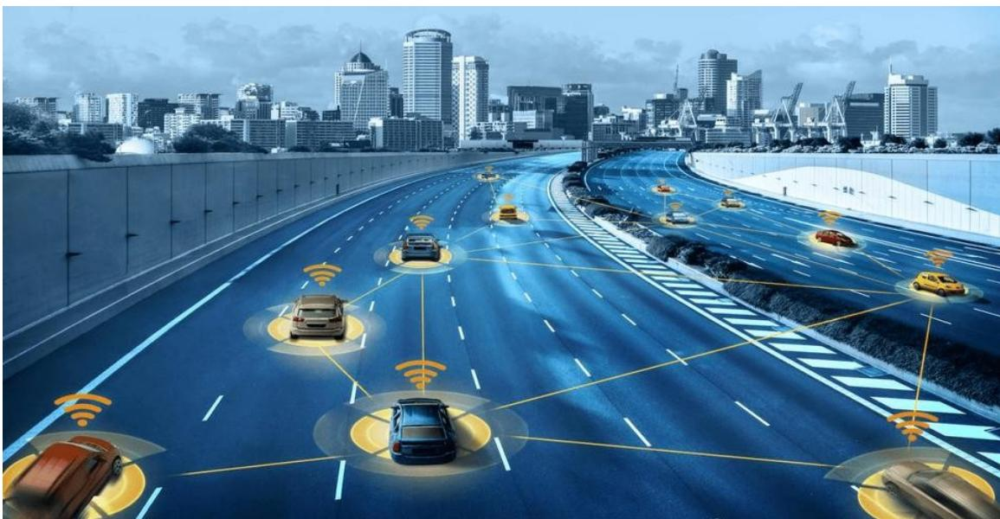
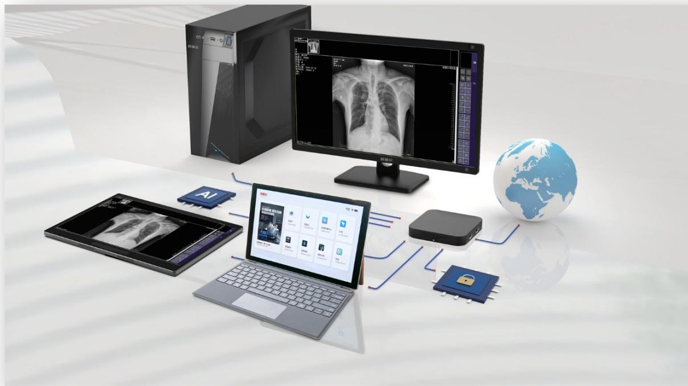
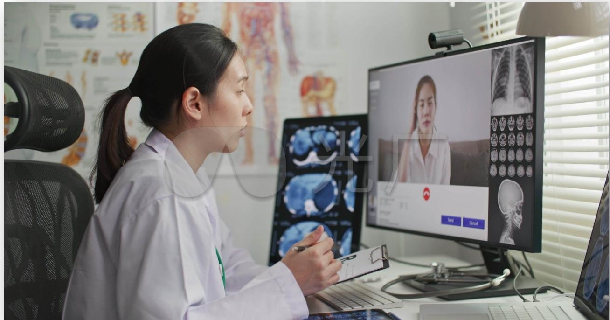
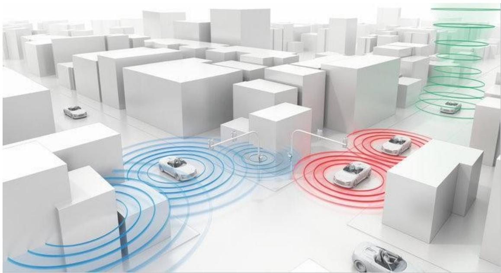
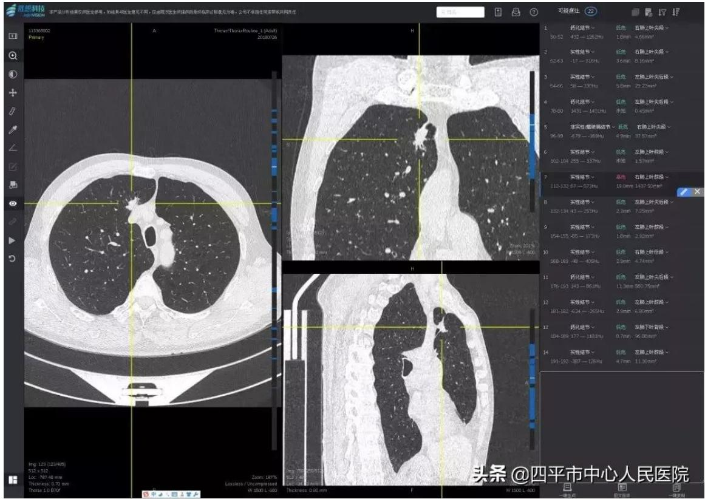

# 人工智能应用场景展示案例设计

# 一、案例主题

智慧生活、智慧驾驶与智慧医疗——人工智能技术赋能生活全场景

# 二、案例资源清单

# （一）图片资源

1. 智能家居全景图：展示配备智能灯光、智能温控、智能安防设备的现代化客厅，体现设备互联互通的场景。

2. 智能语音助手交互图：用户与智能音箱对话的场景，突出语音交互的便捷性。

3. 自动驾驶汽车示意图：配备多个传感器的自动驾驶汽车行驶在城市道路上的场景。

4. 车联网通信示意图：展示车辆与车辆、车辆与基础设施之间信息交互的示意图。

5. 医疗影像分析图：医生结合人工智能辅助诊断系统分析 CT 影像的场景。

6. 远程医疗服务图：医生通过远程医疗系统为患者诊断的场景。

# （二）文字资源

1. 智能家居介绍：“智能家居通过物联网和人工智能技术实现设备互联互通，智能灯光可根据光线强度自动调节亮度，智能温控系统能学习用户习惯提前调整室内温度，为人们带来便捷、舒适的生活体验。”

2. 智能助手功能说明：“智能语音助手通过语音识别和自然语言处理技术，实现与用户的自然交流，可完成信息查询、设备控制、日程安排等多种任务，大大提升了生活的便利性。”

3. 自动驾驶技术简介：“自动驾驶技术依靠计算机视觉和深度学习，实现环境感知、障碍物识别、决策控制等功能，能有效提高驾驶安全性与效率，推动交通系统智能化。”

4. 车联网优势说明：“车联网技术实现车辆与外部环境的实时通信，V2V、V2I、V2P等通信模式增强了车辆的感知和决策能力，优化了交通流量，提升了交通安全性。”

5. 智慧医疗应用介绍：“智慧医疗借助人工智能技术，在医疗影像分析、个性化医疗、远程医疗等方面发挥重要作用，提升了诊断的精准性和医疗资源的利用效率。”

# 二、动效设计描述

# （一）页面加载动效

页面加载时，首先显示案例主题文字，文字从模糊逐渐清晰，同时背景出现由多个人

工智能相关图标（如智能灯泡、汽车、医疗十字等）组成的动态粒子效果，图标粒子逐渐汇聚成案例主题相关的图形，随后消散。

# （二）板块切换动效

1. 从智慧生活板块切换到智慧驾驶板块时，采用滑动过渡效果，智慧生活相关内容向左滑出屏幕，智慧驾驶相关内容从右侧滑入，同时伴有车辆行驶的轻微音效。

2. 从智慧驾驶板块切换到智慧医疗板块时，采用淡入淡出效果，智慧驾驶内容逐渐淡出，智慧医疗内容逐渐淡入，过渡过程中出现十字医疗图标作为过渡元素。

# （三）元素交互动效

1. 当鼠标悬停在智能家居全景图上时，图中的智能设备（灯光、空调、安防摄像头等）依次亮起高亮边框，并显示简短的功能说明文字，文字从设备位置缓慢上浮，停留2秒后逐渐消失。

2. 点击智能语音助手交互图时，弹出语音交互模拟框，模拟用户与智能助手的对话过程，对话文字以打字机效果逐字显示，同时伴有轻微的语音波形动画。

3. 自动驾驶汽车示意图采用循环动画，汽车在道路上缓慢行驶，车身周围的传感器发出动态的探测波纹，遇到虚拟的行人或障碍物时，波纹会出现明显的波动变化，同时汽车图标会有轻微的减速动画。

4. 医疗影像分析图中，当鼠标点击影像上的病灶区域时，会出现放大动画，展示

病灶的细节，同时旁边弹出人工智能分析出的病灶特征文字，文字以渐显效果呈现。

# （四）视频 / 动图播放功效

1. 智能家居联动动图采用自动循环播放，每次循环开始时，动图会有 0.5 秒的暂停，然后从用户开门的动作重新开始，增强用户对联动过程的感知。

2. 自动驾驶决策过程视频在播放到关键决策点（如识别到行人并减速）时，视频会自动暂停 2 秒，同时出现文字提示“此处为自动驾驶决策关键节点”，随后继续播放。

3. 医疗影像分析动图在识别出病灶后，会有一个闪烁的高亮动画，持续 1 秒，以突出显示识别结果，然后恢复正常的标注状态。

# （五）文字展示动效

1. 板块标题文字采用渐入效果，伴随着轻微的上移动画，从页面外上方移动到指定位置后稳定显示。

2. 描述性文字采用分段显示的方式，当前一段文字完全显示后，间隔 0.3 秒再显示下一段文字，每段文字的第一个字有轻微的放大然后恢复正常大小的动画，增强文字的可读性和吸引力。

# 补充案例

# 一、智慧生活

# 1. 智能家居

1. 核心技术：物联网（Wi-Fi/Zigbee/蓝牙）、AI自适应控制（传感器联动、用户行为学习）。

2. 案例参考：小米全屋智能（智能灯光/温控/安防联动，路由器作为中枢支持断网运行）、智能门锁联动场景（开门自动开灯/调温）。

# 1.1.小米全屋智能

小米全屋智能系统通过物联网与人工智能技术的深度融合，构建了涵盖智能灯光、温控、安防的全场景联动体系，其核心创新在于以路由器为本地中枢，实现断网状态下的稳定运行，既保障了设备协同的实时性，又提升了用户体验的可靠性。

# 1、跨设备联动：场景化体验的核心支撑

小米全屋智能的联动逻辑基于“触发条件- 执行动作”的自动化规则，通过智能门锁、传感器等设备的状态变化触发多系统协同响应，典型场景包括：

- 回家模式：当用户通过小米智能门锁的指纹或密码解锁时，门锁通过Zigbee协议将“开门”信号传输至路由器中枢，立即触发预设指令——客厅智能灯光渐亮至70%亮度（根据室外光照传感器数据动态调整），智能窗帘自动拉开1/3，空调伴

侣启动并将室温调节至用户习惯的  $24^{\circ}C$  （基于历史使用数据学习）。这一过程无需人工干预，从开门到环境适配仅需3秒，实现“无感交互”。

- 离家模式：用户长按门锁“锁门”键3秒后，系统判定为离家状态，路由器中枢同步发送指令：关闭所有灯光与非必要家电（如电视、加湿器），智能安防系统切换至“布防模式”——门窗磁传感器进入实时监测状态，摄像头开始循环录制画面，烟雾报警器提升灵敏度。

- 安防联动：若门窗传感器检测到异常开合，或烟雾报警器触发警报，系统会同时启动多重响应：相关区域灯光闪烁示警，路由器通过本地存储的用户手机号发送短信警报，智能音箱播放语音提示“请注意家中异常情况”。即使断网，这些本地联动功能仍能正常运行，避免网络故障导致的安全漏洞。

这种联动机制打破了单一设备的功能局限，通过场景化逻辑将灯光、温控、安防等系统整合为有机整体，显著提升了居住的便捷性与安全性。

# 2、技术架构：路由器中枢的本地化与智能化

小米全屋智能以路由器为核心中枢，而非依赖云端处理，这一设计是其支持断网运行的关键。路由器通过以下技术实现本地化控制：

- 边缘计算能力：路由器内置AI芯片，可本地存储用户习惯数据（如灯光亮度偏好、温控阈值）和联动规则，无需上传云端即可完成指令解析与设备调度。例如，用户长期在21:00后将卧室灯光调至暖光模式，路由器会自动学习并固化这一规则，断

网时仍能按时执行。

- 多协议兼容：路由器支持 Wi-Fi、Zigbee、蓝牙等多种通信协议，可直接与不同类型设备通信——与智能灯光通过 Zigbee 协议传输控制信号（低功耗且延迟  $<$  100ms），与空调通过 Wi-Fi 传输复杂指令（如温度曲线调节），确保跨设备联动的实时性。

- 断网自愈机制：当网络恢复时，路由器会自动同步断网期间的设备状态数据（如安防警报记录、设备运行日志）至云端，避免信息丢失；若断网时间超过 24 小时，系统会降低非必要设备的功耗（如将传感器采样频率从 1 次 / 秒降至 1 次 / 分钟），延长电池寿命。

这种“本地优先”的架构既降低了对网络稳定性的依赖，又通过边缘计算减少了数据传输延迟，符合文档中“物联网技术与人工智能结合实现设备互联互通”的核心逻辑。

# 3、AI 算法：用户行为学习与动态优化

系统通过持续学习用户行为，动态优化联动策略，体现人工智能的自适应能力：

- 习惯预测：路由器中枢每日凌晨 3 点自动分析前 24 小时的设备使用数据，例如识别出“用户周末上午 10 点偏好将书房灯光调至冷光模式”，则自动将该规则添加至周末场景；若发现用户多次手动修正空调温度（如从  $24^{\circ}C$  调至  $23^{\circ}C$ ），系统会在 3 次修正后将温控阈值更新为  $23^{\circ}C$ 。

- 异常检测：通过分析设备运行曲线识别异常状态，如智能灯光突然频繁闪烁可

能是硬件故障前兆，系统会主动推送提示“建议检查客厅主灯连接”；若用户连续3天未使用某盏灯，路由器会自动降低其联动优先级，避免无效能耗。

- 能源优化：结合峰谷电价时段与用户习惯，智能调整高功耗设备运行时间。例如，识别到用户习惯在23:00后使用热水器，系统会在电价低谷的0:00-6:00自动启动加热，既节省电费，又确保用户晨起时有热水可用。

这些算法驱动的优化让系统从“被动响应”升级为“主动服务”，逐步贴近用户的个性化需求。

# 4、用户价值：从“控制设备”到“适配生活”

小米全屋智能的核心价值在于通过技术整合，将“人适应设备”转变为“设备适应人”。其断网运行能力解决了物联网设备“联网才智能”的痛点，确保特殊场景下的系统可靠性；跨设备联动则简化了复杂操作，尤其对老人、儿童等群体更友好。正如文档所述，智能家居“通过优化居住环境提升生活便利性与安全性”，小米全屋智能正是这一理念的实践——以技术隐形化实现体验显性化，让用户感受不到技术存在，却能时刻享受其带来的便捷。

# 1.2.智能门锁联动场景

小米智能门锁的联动场景是智能家居设备协同工作的典型案例。当用户通过指纹或密码打开智能门锁时，门锁通过无线网络将开门信号传输至中枢控制系统（如小米

路由器），触发预设联动指令：客厅的智能灯光自动亮起，亮度根据室外光照强度调整；智能温控设备同时启动，根据用户习惯将室温调节至舒适区间。

这种联动依赖传感器的实时信息交互与AI对用户行为的学习，例如系统通过历史数据识别用户回家高峰时段，提前预热温控设备，确保开门时环境已适配需求，即使断网状态下，路由器作为本地中枢仍能保障基础联动功能正常运行。

# 2. 智能助理

1. 核心技术：语音识别（降噪/口音适配）、自然语言处理（多轮对话/意图理解）。

2. 案例参考：DeepSeek（超长对话/多语言切换/情感识别）、小爱同学（智能家居控制/日程管理）。

# 2.1. DeepSeek

DeepSeek作为一款集成了前沿人工智能技术的智能助理，在超长对话、多语言切换和情感识别三大核心功能上展现了显著优势，其设计理念围绕“自然交互”与“个性化服务”展开，通过深度学习与自然语言处理技术的融合，实现了从“被动响应”到“主动理解”的跨越，成为连接用户与数字世界的高效桥梁。

# 1、超长对话：上下文延续与个性化适配

DeepSeek的超长对话能力打破了传统智能助理的交互时长限制，通过动态记忆

机制实现多轮对话的连贯性与语境延续性。其核心技术在于 Transformer 架构的长序列处理能力，能够实时存储并调用对话历史信息，确保用户在长时间交互中无需重复说明背景，系统即可理解上下文逻辑。例如，当用户围绕“制定周末旅行计划”这一主题展开多轮对话时，从“推荐目的地”“查询天气”到“预订酒店”，DeepSeek 能持续关联前文信息，如根据用户提到的“偏好海滨城市”自动过滤内陆景点，并结合“带老人同行”的需求优先推荐无障碍设施完善的酒店。

更重要的是，系统会通过持续学习用户的表达习惯优化回应风格。文档中提到，若用户常要求“用比喻解释复杂概念”，DeepSeek 会逐渐在回答中增加类比内容，如将“神经网络的层级结构”类比为“工厂的流水线加工”，使专业知识更易理解。这种个性化适配源于对用户交互数据的隐性学习，通过分析句式偏好、常用词汇和知识接受方式，动态调整输出策略，让长期使用者感受到“越用越懂你”的体验。

# 2、多语言切换：跨语种理解与方言适配

DeepSeek 在多语言支持上实现了突破，不仅能实时翻译并生成 100 多种语言内容，还针对方言和网络流行语进行了深度优化，解决了传统智能助理在语言多样性上的局限性。其多语言处理依赖预训练语言模型的跨语种迁移能力，通过在海量平行语料上的训练，模型能捕捉不同语言的语义关联，实现“输入中文、输出英文”“输入日语、理解韩语”的跨语种交互。例如，用户用粤语询问“附近有咩好食喝茶餐厅”，系统能准确识别方言词汇“咩”（什么）和“食哦”（吃的），并以粤语回复推荐周

边门店，同时支持一键切换为普通话或英语输出。

针对网络流行语的理解是其另一亮点。系统通过持续爬取社交媒体数据，动态更新流行语库，能识别“绝绝子”“躺平”“内卷”等词汇的含义及情感倾向，并在回应中自然运用。这种能力使其在年轻用户群体中更具亲和力，例如当用户说“这剧太上头了”，DeepSeek会理解为“剧情吸引人”，并推荐同类型剧集，展现出对当代语言文化的深度融入。

# 3、情感识别：语境感知与共情回应

DeepSeek的情感识别技术超越了简单的关键词匹配，通过融合文本语义、表情符号和语气特征，实现对用户情绪状态的精准判断，并据此调整回应策略。其核心是基于BERT的情感分类模型，能从文字中提取情绪倾向（正面、负面、中性），并结合标点符号（如“！”表示强烈情绪）、表情符号（如“”“”）和句式结构（如反问句表达不满）综合分析情感强度。

例如，当用户输入“这道题太难了”时，系统识别到“难”传递的挫败感和哭泣表情强化的负面情绪，会自动切换为鼓励性话术：“别着急呀，这道题的难点在于公式变形，我们可以先从第一步推导开始，我陪你慢慢理清楚～”；若用户发送“终于搞定了！”，则会以庆祝语气回应：“太棒了！看来你花了不少心思，值得一个小奖励呢～”。这种共情式回应源于对情感需求的深层理解——不仅解决问题，更注重缓解用户的情绪压力，文档中提到其“能通过微表情符号、语气词判断用户情绪，

动态调整回复策略”，正是这一技术的直观体现。

# 总结：从工具到伙伴的体验升级

DeepSeek 通过超长对话实现上下文连贯，多语言切换打破沟通壁垒，情感识别赋予交互温度，三者协同构建了“以用户为中心”的智能服务体系。其技术逻辑印证了文档中对智能助理的定位：“通过自然语言处理与生成式人工智能技术，提供准确、及时的健康咨询和建议”，而 DeepSeek 将这一理念拓展到更广泛的场景，无论是工作学习中的问题解答，还是日常生活中的情感陪伴，都展现了人工智能从“功能工具”向“智能伙伴”的进化趋势。这种进化不仅依赖算法的精进，更源于对人类交互需求的深刻洞察——技术的终极目标，是让机器的“智能”服务于人的“体验”。

# 2.2. 小爱同学

小爱同学作为智能助理，在智能家居控制和日程管理方面实现了便捷的人机交互。在智能家居控制上，用户通过语音指令即可操控各类设备，例如说“打开书房的灯”“把空调调到 26 度”，小爱同学能快速响应并执行操作，还支持多设备联动，如“打开影院模式”时，自动关闭灯光、降下窗帘并开启投影仪。

在日程管理方面，用户可让小爱同学设置提醒事项，如“明天早上 7 点叫醒我”“下午 3 点开会提醒”，它会按时发出提示；还能整合用户的日程安排，提前告知当天待办事项，帮助用户合理规划时间，提升生活与工作的效率

# 3.智能娱乐与个性化推荐

1. 核心技术：协同过滤（基于用户/物品）、内容推荐、深度学习优化（如抖音混合推荐算法）。

2. 案例参考：抖音个性化视频流（结合用户行为与内容特征）、Netflix影视推荐（混合模型提升精准度）。

# 3.1.抖音个性化视频流

3.1. 抖音个性化视频流抖音的个性化视频流是人工智能推荐算法在内容分发领域的典型应用，其核心在于通过深度融合用户行为数据与视频内容特征，实现“千人千面”的精准推荐。这一系统依托混合推荐算法框架，整合协同过滤、内容推荐及深度学习技术，持续优化推荐策略，既贴合用户实时兴趣，又能拓展潜在偏好，成为支撑平台高用户粘性的核心动力。

# 1、用户行为数据的多维度解析

1、用户行为数据的多维度解析抖音推荐系统首先通过全方位捕捉用户行为，构建精准的用户画像。这些行为数据涵盖显性互动与隐性反馈，共同构成算法判断用户偏好的核心依据：

- 互动行为：用户对视频的点赞、评论、分享、收藏等主动操作，直接反映内容吸引力。例如，对美食类视频的高频点赞会让系统判定用户对该领域的强兴趣，进而增加同类内容曝光；

- 观看行为：观看时长是关键隐性指标——完整看完甚至反复观看的视频，会被标记为“高相关性”，而秒滑行为则暗示内容不符合偏好；

- 搜索与历史轨迹：用户搜索“健身教程”“旅行攻略”等关键词后，系统会短期内强化相关内容推荐；长期浏览轨迹（如连续一周关注萌宠视频）则会形成稳定兴趣标签；

- 设备与环境数据：结合用户地理位置（如推送本地美食探店）、使用时段（深夜推送情感类或助眠内容）等，进一步细化推荐场景。

这些数据通过实时数据流管道传入算法引擎，经清洗和特征提取后，成为用户兴趣模型的输入源，为后续推荐提供基础依据。

# 2、视频内容特征的结构化提取

为实现内容与用户的精准匹配，抖音对每支视频进行多维度特征解析，将非结构化的视频内容转化为算法可理解的结构化数据：

- 标签体系：通过自然语言处理（NLP）识别视频标题、字幕中的关键词（如“职场干货”“搞笑”“穿搭”），结合人工标注与AI自动分类，形成多级标签体系；

- 视觉特征：利用计算机视觉技术提取画面元素——人物性别、场景类型（室内/户外）、画面风格（复古/清新）等，例如识别出“宠物”“海边”“舞蹈”等视觉主题；

- 音频特征：分析背景音乐风格（流行/古典）、语音语调（欢快/悲伤），甚至提

取关键音效（笑声、掌声），匹配用户对音频风格的偏好；

- 创作者特征：关联创作者粉丝量、历史内容风格、粉丝画像等，例如向喜欢“知识科普”的用户优先推送同领域优质创作者的新内容。

这些特征被编码为高维向量，存储于内容特征库中，等待与用户兴趣向量进行匹配计算。

# 3、混合推荐算法的协同运作

抖音采用“混合推荐”策略，融合协同过滤、内容推荐及深度学习模型的优势，平衡推荐的精准性与多样性：

- 协同过滤的“群体智慧”：基于用户行为的协同过滤分为“用户协同”和“物品协同”。前者通过计算用户相似度（如A和B都喜欢美食视频），将B看过的优质内容推荐给A；后者则基于视频相似度（如“同款舞蹈”“同BGM”），为观看过视频X的用户推荐相似视频Y。这种方式能快速捕捉流行趋势，例如某支舞蹈视频爆火后，系统会通过物品协同推荐同款内容，形成传播热潮。

- 内容推荐的“精准匹配”：当用户行为数据不足（如新用户）时，内容推荐成为核心策略。系统根据视频标签与用户初始选择（如注册时选择的“音乐”“游戏”兴趣）进行匹配，例如向标注“喜欢音乐”的新用户推送热门音乐现场视频，解决“冷启动”问题。

- 深度学习的“动态优化”：抖音引入深度神经网络（如CNN、Transformer）处

理高维用户与内容特征，通过 embedding 技术将用户兴趣和视频特征映射到同一向量空间，计算相似度得分。模型会实时学习用户行为变化，例如用户近期从“美食”转向“健身”时，算法能快速调整推荐权重，避免推荐“窄化”。

此外，系统还会通过强化学习优化“探索与利用”平衡——既推送  $80\%$  的已知兴趣内容，也混入  $20\%$  的潜在兴趣内容（如向喜欢“家常菜”的用户推荐“健康轻食”），保持推荐新鲜感。

# 4、实时反馈与迭代：让推荐 “越用越懂你”

抖音推荐系统的核心优势在于实时迭代机制。每一次用户行为（如点击、滑走）都会被视为反馈信号，通过在线学习更新模型参数：

当用户连续滑过某类视频时，系统会降低该类内容权重；若某支视频在特定人群中获得高完播率，会被快速分发给相似用户群；结合实时热点（如节日、热搜事件）调整推荐池，确保内容时效性。

这种动态调整机制让推荐流始终与用户兴趣同步，形成“观看- 反馈- 优化”的闭环，这也是抖音用户“刷不停”的核心原因。

综上，抖音个性化视频流通过解析用户行为、提取内容特征、融合多元算法，构建了一套精准且灵活的推荐体系。其成功不仅依赖技术创新，更在于对“用户- 内容”互动关系的深刻理解，为人工智能在内容分发领域的应用提供了经典范例。

# 3.2.Netflix影视推荐

3.2. Netflix影视推荐Netflix作为全球领先的流媒体平台，其核心竞争力之一在于依托人工智能推荐算法实现的个性化影视推荐系统。该系统通过融合协同过滤、内容推荐等多种技术，结合用户行为与内容特征，为全球数亿用户精准推送符合其偏好的影视内容，显著提升了用户留存率与观看时长。

# 1、协同过滤：挖掘用户与内容的关联规律

协同过滤是Netflix推荐系统的基础技术，通过分析用户行为数据挖掘潜在关联，分为基于用户和基于物品两种模式。

基于用户的协同过滤通过计算用户相似度实现推荐。例如，若用户A与用户B对多部独立电影给出相似评分，系统会判定两人偏好相近，将B看过且A未观看的影片推荐给A。这种方式能快速捕捉群体兴趣趋势，尤其适用于热门内容的传播。

基于物品的协同过滤则聚焦于影视内容间的关联性。如果观看《怪奇物语》的用户中有  $80\%$  也观看了《黑暗物质三部曲》，系统会认为这两部剧集存在强关联，当用户观看前者时，自动推荐后者。这种模式在内容更新频繁的场景中表现突出，能及时响应新剧上线后的用户反馈。

协同过滤的优势在于无需解析内容本身，仅通过行为数据即可生成推荐，但也存在“冷启动”问题——新用户或新内容因缺乏数据难以被精准推荐。为此，Netflix早期通过“Netflix Prize”竞赛优化算法，将预测准确率提升了  $10\%$  ，显著改善了用户

体验。

# 2、内容推荐：基于特征的精准匹配

内容推荐技术通过解析影视内容的固有特征，实现与用户偏好的精准匹配，有效弥补了协同过滤的短板。Netflix会从多个维度提取影视特征：

- 元数据特征：包括类型（剧情、科幻、喜剧等）、导演、演员、时长、评分等结构化信息；

- 内容描述特征：通过自然语言处理（NLP）分析剧情简介、台词文本，提取主题（如“时空穿越”“家庭伦理”）、情感倾向（如“温情”“悬疑”）等非结构化特征；

- 用户生成特征：如影评关键词、标签云等，反映观众对内容的主观认知。

例如，对于喜欢“诺兰导演 + 科幻题材”的用户，系统会通过内容推荐主动推送《星际穿越》《信条》等符合特征的影片。这种方式不依赖用户历史交互数据，能有效解决新内容的冷启动问题，确保优质新剧快速触达目标受众。

# 3、混合推荐模型：整合优势的最优解

Netflix最终采用混合推荐模型，融合协同过滤与内容推荐的优势，兼顾推荐的精准性与多样性。其核心逻辑包括：

- 加权融合：对协同过滤与内容推荐的结果按权重合并，权重根据用户活跃度动

态调整——新用户权重偏向内容推荐，老用户则更多依赖协同过滤；

- 分场景推荐：首页不同板块采用不同算法，如“为你推荐”板块侧重协同过滤，“新上线”板块侧重内容推荐；

- 引入深度学习：通过神经网络分析用户观看时长、暂停/快进行为等细粒度数据，捕捉隐含偏好。例如，用户反复观看某段剧情可能暗示对特定角色的喜爱，系统会据此强化同类角色的影视推荐。

混合模型不仅解决了单一算法的局限性，还能平衡“探索”与“利用”——既推送用户已知偏好的内容（如反复观看的喜剧类型），也适度推荐潜在兴趣内容（如从喜剧拓展至轻喜剧），避免推荐“信息茧房”。

# 4、实际效果与技术价值

Netflix的推荐系统直接推动了业务增长：据公开数据，其推荐内容贡献了用户80%的观看决策，显著降低了用户流失率。从技术角度看，该系统验证了混合推荐模型的有效性——通过协同过滤把握群体趋势，通过内容推荐保障个性化精准度，再结合深度学习捕捉动态偏好，形成了“数据- 模型- 体验”的正向循环。

这种技术路径也为其他内容平台提供了借鉴：通过多维度数据融合与算法协同，在海量内容中为用户快速定位价值点，最终实现“千人千面”的个性化服务。正如文档所述，混合推荐“能够处理更多维度的数据，提升个性化推荐的质量，并有效解决协同过滤和内容推荐中各自的局限性”，这正是Netflix推荐系统持续领先的核心原因。

# 二、智慧驾驶

# 1. 自动驾驶技术

1. 核心技术：环境感知（摄像头/激光雷达融合）、决策系统（深度学习/强化学习）、SAE分级（L0-L5）。

2. 案例参考：特斯拉Autopilot（视觉感知 + 神经网络决策）、百度“萝卜快跑”（L4级自动驾驶测试）。

# 1.1.特斯拉Autopilot

特斯拉Autopilot作为智能驾驶领域的先锋技术，通过创新性地融合视觉感知与神经网络决策机制，为用户带来了先进的驾驶辅助体验，推动了汽车行业向智能化、自动化方向的变革。

# 1、视觉感知：多摄像头构建的“汽车之眼”

Autopilot 的视觉感知系统是其实现智能驾驶的基石，依靠分布于车身四周的 8 个摄像头，构建起 360 度无死角的环境监测网络。这些摄像头各司其职，拥有不同的视野范围与焦距，以捕捉多样化的路况信息：3 个前置摄像头，包括一个 120 度鱼眼镜头用于监测近距离障碍物、交通信号灯，以及两个分别提供中长距离聚焦视野的摄像头，可探测最远 250 米处的物体，为高速行驶时的提前预判提供支持；2 个前向侧摄像头能敏锐察觉意外闯入车道的车辆，在复杂路口提供额外安全保障；2 个后向侧摄像头时刻关注车辆两侧的盲区，辅助安全变道与汇入车流；1 个后视摄像头不仅助力安全倒车，更在复杂停车操作中发挥关键作用。

摄像头采集的原始图像数据分辨率达  $1280 \times 960$ ，12- Bit，帧率为 36Hz，以 RAW 格式输入，保留了最丰富的视觉细节。这些数据被传输至车载计算机，通过特斯拉自主研发的先进视觉处理工具——基于深度神经网络的 Tesla Vision 进行解析。Tesla Vision 能够将汽车周边环境解构为机器可理解的信息，其可靠性远超传统视觉处理技术，可精准识别道路上的汽车、行人、交通标识、车道线等关键元素，以及它们的位置、速度、方向等动态参数。

# 2、神经网络决策：模拟人脑的智能中枢

为了让视觉感知数据转化为合理的驾驶决策，Autopilot 引入强大的神经网络决策系统。车载计算机硬件 3 相比前代，数据处理能力提升超 40 倍，运行着特斯拉自研的神经网络，成为整个系统的智能核心。

神经网络决策过程极为复杂且精妙。首先，通过残差神经网络（RegNet）及BiFPN多尺度特征融合结构，对原始视频数据进行端到端训练，提取多尺度视觉特征空间（feature map）。随后，在头部层针对物体检测、交通信号打识别、车道线识别等1000多个不同任务类型完成子网络训练，并输出精准的感知结果。这种多任务共享特征空间的HydraNet网络设计，避免了不同任务间的重复计算，大幅提升网络运行效率，同时允许各子任务独立微调，互不干扰。

在将二维图像数据转换为三维向量空间，以实现对现实世界更精准的理解与表达时，Transformer神经网络发挥了关键作用。它基于注意力机制，借鉴人脑处理信息时聚焦关键内容的方式，在面对大规模数据学习任务时表现卓越。通过将HydraNet主干生成的多尺度特征空间处理为Key和Value，对特征空间池化得到全局描述向量并结合BEV空间各栅格位置编码生成Query，Transformer模型能够精准计算不同信息间的关联权重，将地面坡度、曲率等几何变化信息融入神经网络训练参数，从而准确感知和预测物体深度信息，为后续决策提供坚实的数据基础。

此外，为弥补瞬时感知的局限性，赋予系统短时记忆能力，特斯拉在感知网络架构中引入时空序列特征层。结合IMU传感器获取的自车运动信息，生成基于时间和空间维度的特征队列，运用三维卷积、Transformer、RNN等方法实现时序信息融合，得到多传感器融合的视频流时空特征空间。如此一来，Autopilot在面对恶劣天气、突发事件、遮挡场景等复杂情况时，也能凭借对过往信息的记忆和分析，做出更合理、

更安全的决策。

# 3、实际应用与效果呈现

在实际驾驶场景中，Autopilot展现出了强大的功能与优势。基础Autopilot包含的交通感知巡航控制，可自动维持车速并与前车保持安全且可调节的跟车距离；自动辅助驾驶功能则在保持车速和车距的同时，智能引导车辆保持在车道内行驶。而增强版Autopilot进一步拓展功能边界，自动辅助变道功能在开启转向灯且自动辅助驾驶激活时，能安全地将车辆驶入相邻车道；导航辅助驾驶可在高速公路上实现从匝道到匝道的主动引导，自动完成变道、导航互通、开启转向灯及选择正确出口等操作；自动泊车功能支持平行或垂直停车，召唤功能让用户在车外也能控制车辆前后移动，方便在狭窄车位停车。

大量实际测试与用户反馈表明，Autopilot显著减轻了驾驶员在长途驾驶、拥堵路况等场景下的疲劳感，提升了驾驶安全性与舒适性。例如，在高速公路上，系统能精准识别前车速度变化并平稳加减速跟车，在复杂路况下也能迅速识别交通信号灯与标识并做出相应反应。不过，需要明确的是，Autopilot目前仍属于驾驶辅助系统，驾驶员需时刻保持注意力并随时准备接管车辆，以应对系统可能无法处理的极端或特殊情况。

总之，特斯拉Autopilot通过视觉感知与神经网络决策的深度融合，为智能驾驶发展树立了标杆，尽管距离完全自动驾驶仍有进步空间，但其技术创新与实践应用为

行业探索未来出行模式提供了宝贵经验与方向指引。

# 1.2.百度 “萝卜快跑”

在自动驾驶领域，百度“萝卜快跑”作为行业的重要参与者，以其先进的技术和广泛的实践，成为L4级自动驾驶测试的典型代表。它不仅展示了百度在自动驾驶技术上的深厚积累，也为未来智能出行的发展提供了宝贵的经验和方向。

“萝卜快跑”的发展历程是一部不断探索与突破的奋斗史。2013年，百度开始布局自动驾驶，无人车项目启动，这是其迈向自动驾驶领域的重要开端。此后，一系列重要节点不断推动着项目的发展。2017年，百度宣布Apollo计划，为自动驾驶技术的发展提供了更广阔的平台；2021年8月，全新升级的自动驾驶出行服务平台“萝卜快跑”正式发布，并陆续在多个城市落地，开启了面向公众的自动驾驶出行服务。截至2025年5月，萝卜快跑在全球累计提供超1100万次的出行服务，其足迹遍布北京、武汉、上海、广州、深圳等众多城市，甚至拓展到了海外的迪拜、阿布扎比等地，服务范围不断扩大。

L4级自动驾驶是“萝卜快跑”的核心技术追求。这一等级意味着车辆在特定的运行条件下能够持续执行所有动态驾驶任务，并自动执行最低风险策略。为了实现这一目标，“萝卜快跑”配备了一系列先进的技术。在硬件方面，其第五代自动驾驶车辆搭载定制激光雷达与毫米波雷达，多种传感器协同工作，如同为车辆赋予了“感知之眼”，使其能够实时感知周围环境，构建高精度的三维地图。同时，“萝卜快跑”

还拥有计算单元与传感器多层冗余、底盘安全冗余等46项安全保障能力，即使部分系统出现故障，车辆仍能保持安全运行，极大地提升了可靠性。

软件层面，“萝卜快跑”依托百度强大的算法和人工智能技术。2024年发布的全球首个支持L4级自动驾驶的大模型ApolloADFM，基于大模型技术重构无人驾驶系统，具备安全性与泛化性兼顾的特点。它能够对传感器收集到的数据进行快速处理和分析，精准识别道路状况、交通信号、行人行为等复杂信息，从而做出智能决策，实现自动控制方向盘、识别红绿灯、调整车速等功能。在实际测试和运营中，“萝卜快跑”展现出了较高的自动驾驶能力，行驶过程平稳，基本没有急刹情况。

在商业化运营方面，“萝卜快跑”也取得了显著进展。2022年7月，百度萝卜快跑首批25辆北汽极狐无人化车辆正式获准开展常态化付费出行服务，标志着中国无人化出行服务从载人示范迈入商业化试点新阶段。截至2024年5月，萝卜快跑在中国完成超600万次的出行服务；在2025年第一季度，萝卜快跑在全球提供超140万次出行服务，同比增长  $75\%$  。其通过动态定价模型，根据市场需求和车辆利用率调整价格，既保证了公司的盈利，又确保了用户能够接受。而且，“萝卜快跑”还与移动出行服务平台Uber建立战略合作伙伴关系，将服务拓展至美国和中国大陆以外的全球多个市场，进一步扩大了商业版图。

尽管“萝卜快跑”在L4级自动驾驶测试和商业化运营方面取得了诸多成果，但也面临着一些挑战。技术上，虽然其在特定场景下表现出色，但要实现更广泛的应用，

还需进一步提高系统的稳定性和适应性，降低成本。目前，其单车改造成本较高，这在一定程度上限制了大规模推广。法规和监管方面，自动驾驶技术的快速发展对现有的交通法规和监管体系提出了新的要求，需要相关政策的进一步完善和支持。

百度“萝卜快跑”在L4级自动驾驶测试领域取得了令人瞩目的成绩，为自动驾驶技术的发展和智能出行的未来奠定了坚实基础。随着技术的不断进步和商业化的深入推进，“萝卜快跑”有望在未来出行领域发挥更大的作用，引领智能交通的变革。

# 2. 车联网与智能交通系统

1. 核心技术：V2X通信（V2V/V2I/V2P）、AI交通优化（动态信号灯／流量预测）。2. 案例参考：北京中关村智能信号灯（AI动态调整配时）、C-V2X技术（路口盲区预警）。

# 2.1.北京中关村智能信号灯

在北京中关村，智能信号灯正凭借AI动态调整配时技术，重塑区域交通格局，为城市交通治理提供了创新范例。

中关村作为科技创新高地，人口与车流量巨大，交通状况复杂。传统信号灯采用单点控制信号机，时间固定，难以适应实时变化的交通流量，导致拥堵时常发生，车辆通行效率低下。为改善这一状况，中关村对信号灯进行了升级改造，引入AI动态调整配时技术，实现信号灯的智能化。

智能信号灯通过多种车辆采集装置，如地磁传感器、高清摄像头等，实时收集车流量、车道占有率、车辆速度及车间距等关键指标。这些装置如同信号灯的“感知触角”，分布在各个路口，为信号灯提供精准的数据支持。收集到的数据会传输至后台，经过复杂的算法综合分析后，信号灯在确保行人和非机动车有充足时间通过路口的前提下，自动对信号灯配时进行优化调整。例如，当某个方向车流量增加时，系统会适当延长该方向的绿灯时长，减少车辆排队长度，缓解拥堵；车少的时候，则缩短绿灯时间，提高道路整体利用率。

以早高峰时段为例，根据搜狐网2025年8月12日发布的《赛诺杰红绿灯：中国智造如何点亮全球十字路口？》，智能信号灯能自动感知车流变化，为主干道延长绿灯时间，保障主要道路的车辆快速通行，提高整体通行效率。深夜车流量较小时，信号灯自动调暗亮度，在节省能源的同时，避免灯光对周边居民的干扰。

AI 动态调整配时技术在中关村的应用效果显著。据人民网 2020 年 8 月 6 日消息，中关村西区交通科技系统工程投用后，早高峰时段基本由轻度拥堵、中度拥堵转变为畅通、基本畅通，交叉路口进口道行车速度均有所提升。另据搜狐网 2025 年 4 月 16 日发布的《从被动响应到智能预判：赛诺杰如何用军工级技术守护行人安全》，赛诺杰系统部署半年后，该区域行人平均等待时间从 135 秒缩短至 49 秒，网约车违规停靠减少  $72\%$ ，高峰时段通行效率提升超  $30\%$ 。

中关村智能信号灯的优势不仅体现在缓解交通拥堵上。其采用的 AI 技术还能与其他智能交通系统协同工作，如与百度地图等车联网平台融合，为驾驶员提供更精准的导航信息，引导车辆避开拥堵路段。同时，智能信号灯还具备自诊断功能，管理人员在指挥中心可远程诊断设备状态，故障自检系统能精确定位异常芯片，维修响应速度提升  $60\%$ ，大大降低了维护成本，保障了系统的稳定运行。

此外，在保障行人安全方面，智能信号灯也有出色表现。当检测到儿童或老人时，绿灯时长会智能延长；系统还能识别视障人士的导盲犬或盲杖，自动激活导航声波与触觉地砖振动，为特殊人群提供便利。

不过，中关村智能信号灯在发展过程中也面临一些挑战。一方面，随着城市的发展和交通流量的进一步增长，对智能信号灯的算法和硬件性能提出了更高要求，需要不断优化和升级，以适应更加复杂的交通场景。另一方面，智能信号灯涉及大量的数据收集和处理，数据的安全性和隐私保护问题也不容忽视。

北京中关村智能信号灯的 AI 动态调整配时技术，在缓解交通拥堵、提升通行效率、保障行人安全等方面取得了显著成效，为城市交通治理提供了成功范例。未来，随着技术的不断完善和发展，智能信号灯有望在更多城市推广应用，为人们带来更加便捷、高效、安全的出行体验。

# 2.2. C-V2X 技术

在现代交通体系中，路口作为交通流汇聚与分散的关键节点，交通状况复杂，潜藏着诸多安全隐患。尤其是路口盲区，由于驾驶员视线受阻，无法及时察觉盲区内的车辆、行人或其他障碍物，极易引发交通事故。据相关统计数据显示，相当比例的交通事故都发生在各类路口，其中因路口盲区导致的碰撞事故占据了一定的比重。而 C- V2X 技术的出现，为解决这一难题带来了新的曙光。

# 1、C-V2X 技术原理剖析

C- V2X，即 Cellular Vehicle- to- Everything，是一种基于蜂窝网络的车用无线通信技术。它就像是构建了一张无形的“信息网”，将车辆与车辆（V2V）、车辆与基础设施（V2I）、车辆与行人（V2P）以及车辆与网络（V2N）紧密相连，实现全方位、实时的信息交互。

在路口盲区预警这一应用场景中，C- V2X 技术主要通过车与车、车与基础设施之间的通信发挥作用。当车辆驶向路口时，安装在车辆上的车载单元（OBU）以及部署在路口周边的路侧单元（RSU）开始协同工作。RSU 如同一位不知疲倦的“观察者”，实时收集路口的交通信息，包括过往车辆的速度、位置、行驶方向等，并通过无线通信链路将这些信息广播出去。同时，车辆的 OBU 也在持续接收来自周边 RSU 以及其他车辆 OBU 发送的信息。

一旦有车辆进入路口盲区范围，即便处于驾驶员视线之外，其自身 OBU 发送的位置、速度等关键信息也能被周围车辆的 OBU 以及 RSU 获取。通过对这些信息的快速分析与处理，系统能够精准判断车辆之间是否存在碰撞风险。若检测到潜在危险，便会立即向相关车辆驾驶员发出预警信号，提醒其采取减速、避让等措施，从而有效避免碰撞事故的发生。

# 2、技术优势彰显安全保障实力

C- V2X 技术在路口盲区预警方面展现出了诸多显著优势。

首先，其具备低时延特性。在交通场景中，时间就是安全的关键。C- V2X 技术能

够确保信息在车辆与基础设施、车辆与车辆之间快速传输，从信息的采集到预警信号的发出，整个过程所耗费的时间极短，通常能控制在几十毫秒以内。这使得驾驶员有足够的时间对潜在危险做出反应，大大提高了应对突发情况的及时性。

其次，通信可靠性极高。与传统的一些短距离通信技术相比，C- V2X 基于蜂窝网络，信号覆盖范围更广且稳定性更强。无论是在高楼林立的城市街区，还是在环境复杂的郊区路口，都能保证信息的可靠传输，有效避免因信号遮挡、干扰等问题导致的通信中断或信息丢失，为路口盲区预警提供了坚实的通信保障。

再者，C- V2X 技术的信息交互具有全面性。它不仅能获取车辆的位置、速度等基本信息，还可以传输诸如车辆的行驶意图、加速度等更丰富的数据。这使得系统在判断碰撞风险时能够综合考虑更多因素，预警结果更加准确可靠。例如，当一辆车突然加速驶向路口盲区时，系统能够根据其加速度信息更快地判断出潜在危险，并及时发出预警。

# 3、实际应用场景展示

在实际的交通场景中，C- V2X 技术的路口盲区预警功能发挥着重要作用。

以城市道路的十字路口为例，假设一辆轿车正沿着主干道正常行驶，准备通过路口。此时，在其右侧的支路上有一辆摩托车正快速驶向路口，但由于路口处有建筑物遮挡，轿车驾驶员无法直接观察到摩托车的存在。然而，轿车和摩托车上均安装了 C- V2X 的 OBU 设备，路口周边也部署了 RSU。摩托车的 OBU 持续向外发送自身的位置、

速度等信息，这些信息被路口的RSU接收后，经过分析处理，RSU判断出摩托车与轿车存在潜在碰撞风险。于是，RSU立即将预警信息发送给轿车的OBU，轿车的车载系统随即发出声音警报，并在仪表盘上显示醒目的警示标识，提醒驾驶员注意右侧来车。驾驶员在收到预警后，及时采取刹车减速措施，成功避免了一场可能发生的碰撞事故。

再比如在一些学校附近的路口，上下学时段人流量较大，学生们的行动路线较为复杂。C- V2X技术可以通过车辆与行人之间的通信（V2P）实现对行人的监测与预警。当有车辆驶向路口时，若有学生进入盲区范围，安装在学生携带设备（如智能手环等）上的V2P模块会与车辆的OBU进行通信，车辆能够提前得知盲区内有行人存在，从而提前减速慢行，保障学生的安全通行。

# 4、面临挑战与发展展望

尽管C- V2X技术在路口盲区预警方面展现出了巨大的潜力，但在推广应用过程中仍面临一些挑战。一方面，技术的大规模普及需要车辆制造商、通信运营商、交通管理部门等多方协同合作。目前，C- V2X设备在车辆上的安装率还相对较低，要实现车辆之间、车辆与基础设施之间广泛的信息交互，需要推动更多车辆配备相关设备，这涉及到成本控制、技术标准统一等诸多问题。另一方面，C- V2X技术依赖于通信网络，虽然蜂窝网络覆盖范围不断扩大，但在一些偏远地区或信号薄弱区域，仍可能存在网络覆盖不足的情况，这对技术的稳定运行构成一定影响。

不过，随着 5G 技术的快速发展与普及，C- V2X 技术迎来了新的发展机遇。5G 网络的高速率、低时延和大连接特性，能够进一步优化 C- V2X 的通信性能，提升路口盲区预警的精准度和及时性。同时，随着产业各方对智能交通的重视程度不断提高，相关政策的支持力度也在逐步加大，这将有力推动 C- V2X 技术的研发创新与推广应用。未来，C- V2X 技术有望在智能交通领域发挥更大的作用，不仅在路口盲区预警方面持续优化，还将与自动驾驶技术深度融合，为人们创造更加安全、高效、便捷的出行环境，成为构建未来智慧交通体系的核心技术之一。

# 三、智慧医疗

# 1. 医疗影像分析与诊断支持

1. 核心技术：计算机视觉（CNN 肿瘤检测）、诊断决策支持系统（多模态数据融合）。

2. 案例参考：DeepMind 眼底疾病识别、肺结节 AI 检测系统（辅助早期肺癌诊断）。

# 1.1. DeepMind 眼底疾病识别

在医疗领域，人工智能正逐渐展现出强大的力量，DeepMind 的眼底疾病识别技术便是其中的典型代表。这一技术借助先进的人工智能算法和大量医学数据，为眼科疾病的诊断带来了新的变革。

DeepMind 开发的眼底疾病识别技术，核心在于利用深度学习算法对大量的视网膜扫描图数据进行分析。该公司与英国国家医疗服务体系（NHS）以及伦敦的 Moorfields Eye Hospital 展开了为期两年的合作，在此期间，对数千张视网膜扫描图的数据进行了深入分析，以此训练人工智能算法来探测眼病迹象。其算法使用了由 Moorfields 提供、并已由医生仔细地标出疾病迹象的匿名 3D 视网膜扫描图进行训练，从而具备了强大的眼病识别能力。

这项技术在实际应用中表现出色。它可以比人类专家更迅速、更高效地检测出眼疾的症状，能够在大约 30 秒内完成对患者视网膜的扫描分析，并依据病患的紧急程度

评分，给予详细诊断。该系统能够检测包括青光眼、糖尿病视网膜病变和老年性黄斑变性等多种眼疾，且准确程度媲美全球顶尖眼科医生。在与Moorfields眼科医院的合作研究中，以997张扫描片作比较，算法建议转诊的准确度超过了医院的8名视网膜专家，错误率只有  $5.5\%$  ，而专科医生的错误率则在  $6.7\% - 24.1\%$  之间。如果专科医生取得病患的相关讯息，错误率可降至  $5.5\% - 13.1\%$  ，仅和AI打平而已。

此外，DeepMind的眼底疾病识别技术还解决了人工智能“黑箱”问题。它通过在两个不同的神经网络间插入可解释性表征将它们结合起来。第一个神经网络是分割网络，用来分析OCT扫描，提供不同类型的眼组织图，找到疾病特征；第二个神经网络为分类网络，可以用来分析特征图，为人类医生提供诊断意见和转诊推荐，并将所有推荐意见以百分比的形式表示，让人类医生能够了解系统诊断疾病的过程，从而更好地做出诊疗决定。

目前，虽然该技术还未广泛应用于临床，需要经过临床试验和监管部门的批准，但已经展现出了巨大的潜力。如果研究结果通过同行评议，这项技术有望在几年后投入临床试验，一旦成功应用，将极大地提高眼科疾病的诊断效率和准确性，帮助更多患者及时发现和治疗眼疾，避免视力丧失，为全球眼健康事业带来新的希望。而且，这种人工智能具有“普遍化”的特点，未来还可以应用于其他类型的影像分析，在医疗领域发挥更广泛的作用。

# 1.2. 肺结节 AI 检测系统

肺癌，作为全球范围内发病率和死亡率均位居前列的恶性肿瘤，严重威胁着人类的生命健康。早诊早治是提高肺癌患者生存率、改善预后的关键。在早期肺癌的诊断中，肺结节的准确识别与判断至关重要，而肺结节 AI 检测系统的出现，为早期肺癌诊断带来了革命性的变革。

肺结节是指肺内直径小于或等于 3 厘米的类圆形或不规则形病灶，可单发或多发。肺结节的成因复杂，炎症、结核、霉菌感染以及恶性肿瘤等都可能导致其出现。虽然大多数肺结节为良性，但其中部分可能是早期肺癌的表现形式。因此，对肺结节进行精准检测与评估，是实现早期肺癌诊断的核心环节。传统上，肺结节的检测主要依赖医生对胸部 CT 影像的人工判读。然而，胸部 CT 影像数据量庞大，每位患者的 CT 图

像通常可达300至500幅，医生人工筛查不仅耗时费力，平均每例需10分钟以上，而且对于微小的肺结节，尤其是直径小于5毫米的结节，由于其在影像上表现不明显，极易出现漏诊情况。此外，不同医生的经验和主观判断存在差异，也可能导致诊断结果的不一致性。

肺结节AI检测系统则借助先进的人工智能技术，特别是深度学习算法，有效解决了传统检测方式的弊端。该系统通过对海量标注CT影像数据的学习，构建起精准的模型，能够快速、准确地从胸部CT图像中检测出肺结节。具体而言，在结节检测环节，AI算法可以在短短数秒内完成对单例患者CT影像的初筛，速度远超人工筛查。其能够精准识别各种形状、尺寸及位置的结节，对4毫米以上结节的检出率超过  $98\%$  ，其中磨玻璃结节检出率超过  $95\%$  ，大大提高了肺结节的检出效率，减少了漏诊可能性。对于检测到的结节，AI系统会进一步进行多维度的特征分析。它能够自动测量结节的最大径、最小径、体积、CT值等关键参数，提供详细的定量信息。同时，对结节的形状、密度、边缘特征、内部结构等进行综合分析，以此为基础对结节进行精准分型，如实性、磨玻璃、部分实性、钙化、肿块等。更为重要的是，AI系统能够依据这些特征，结合大数据和深度学习模型，预测结节的良恶性概率，为医生的诊断提供有力的辅助参考。

在患者的随访过程中，肺结节AI检测系统同样发挥着重要作用。它可以自动关联患者不同时间点的CT图像，精确对比结节的大小、密度、形态等变化情况，计算结节

的生长速度，即肿瘤倍增时间，帮助医生更准确地判断结节的发展趋势，及时调整诊疗方案。例如，某三甲医院引入肺结节AI检测系统后，早期肺癌的检出率从原本的 $68\%$  大幅提升至  $92\%$  ，单张CT影像的分析时间从15分钟缩短至3分钟。而且，AI系统在识别微小结节（直径  $< 5\mathrm{mm}$  ）、区分良恶性结节（如钙化灶与恶性肿瘤）以及量化结节体积变化（误差  $< 5\%$  ）等方面表现出色，显著提高了诊断的准确性和效率。

北京胸科医院作为本市肺癌专病医联体牵头单位，已将肺小结节人工智能辅助诊断系统推广至全市100余家医疗机构，包括二、三级医院和社区卫生服务中心，并培训300余名基层医师统一诊断标准。部分基层医院技术水平相对较弱、医生经验不足，使用人工智能辅助诊断明显提高了肺小结节筛查准确率。

目前，肺结节AI检测系统在临床应用中已取得显著成效，但仍在不断发展完善。未来，随着技术的进一步优化，AI有望更精准地判断结节良恶性，结合多模态数据，如影像、基因、临床症状等，为早期肺癌诊断提供更加全面、准确的信息，在肺癌的防治工作中发挥更大的作用，助力更多患者实现早期诊断与治疗，提高肺癌患者的生存质量和生存率。

# 2.个性化医疗与基因分析

1. 核心技术：基因测序自动化（华大智造平台）、多组学数据整合（基因组/蛋白质组）。

2. 案例参考：肿瘤靶向药推荐（基于患者基因突变数据）、23andMe基因检测（疾病风险预测）。

# 2.1. 肿瘤靶向药推荐

肿瘤的发生、发展与基因突变密切相关，不同的基因突变会导致肿瘤细胞具有独特的生物学特性。肿瘤靶向药能够精准地作用于这些突变靶点，阻断肿瘤细胞的生长、增殖和转移信号通路，从而实现对肿瘤细胞的特异性杀伤，同时减少对正常细胞的损害。在当今的肿瘤治疗领域，基于患者基因突变数据进行靶向药推荐已成为一种极具前景的精准医疗模式。这种模式通过对患者个体基因信息的深度剖析，为其量身定制最适宜的治疗方案，显著提升了治疗效果和患者的生活质量。

# 1、技术原理

肿瘤的发生和发展与多种基因突变密切相关，不同的基因突变会导致肿瘤细胞的生长、增殖和存活方式有所差异。肿瘤靶向药的设计正是基于对这些基因突变靶点的精准识别和作用。以非小细胞肺癌为例，EGFR（表皮生长因子受体）基因突变是常见的驱动因素之一。当EGFR基因发生敏感突变，如19外显子缺失或21外显子L858R突变时，细胞内的信号传导通路会被异常激活，促使肿瘤细胞不断增殖。针对这一突变，第一代EGFR- TKI（酪氨酸激酶抑制剂）类靶向药，如吉非替尼、厄洛替尼等应运而生，它们能够特异性地抑制EGFR的酪氨酸激酶活性，阻断癌细胞的生长信号传导，从而达到抑制肿瘤生长的目的。随着研究的深入，科学家们发现部分患者在使用

第一代 EGFR- TKI 后会出现耐药，其中常见的耐药突变是 20 号外显子 T790M 突变。于是，第二代、第三代 EGFR- TKI 药物相继研发出来，像阿法替尼、达克替尼等第二代药物，能同时抑制敏感突变和部分耐药突变；而奥希替尼、阿美替尼等第三代药物，对 T790M 突变有更强的抑制作用，且对野生型 EGFR 的抑制作用较弱，在提高疗效的同时降低了副作用。这一系列药物的研发和应用，都是基于对基因突变数据的深入分析和理解。

# 2、推荐流程

- 基因检测：通过对患者的肿瘤组织或血液样本进行基因检测，运用高通量测序技术等先进手段，全面、精准地获取患者的基因突变信息。这些信息就像是肿瘤的“基因密码”，为后续的靶向药推荐提供了关键依据。

- 数据分析与靶点匹配：专业的医疗团队会对检测到的基因突变数据进行详细分析，确定具体的突变类型和相关靶点。然后，结合大量的临床研究数据和药物作用机制，筛选出针对这些靶点的有效靶向药物。例如，对于携带 ALK 融合突变的肺癌患者，克唑替尼、阿来替尼等 ALK 抑制剂就会被纳入考虑范围；而对于存在 BRAF V600E 突变的黑色素瘤患者，维莫非尼等 BRAF 抑制剂则可能是合适的选择。

- 综合评估与方案制定：除了基因信息，医生还会综合考虑患者的身体状况，包括肝肾功能、心脏功能等重要指标，以及患者过往的治疗经历、合并疾病等因素。因为某些靶向药物可能会对特定器官产生一定的影响，所以需要确保患者能够耐受药物

的副作用。同时，药物的疗效和安全性数据也是评估的重要内容，医生会参考临床试验结果和真实世界数据，权衡不同药物的利弊，为患者制定个性化的靶向治疗方案。在一些情况下，如果患者存在多种基因突变，或者没有找到完全匹配的标准靶向药物，医生可能会推荐患者参加相关的临床试验，尝试新的药物或联合治疗方案，为患者提供更多的治疗希望。

# 3、临床案例

在实际临床应用中，基于基因突变数据的靶向药推荐已经取得了显著的成效。许多患者通过这种精准治疗方式获得了更好的治疗效果和生活质量。例如，一位患有晚期非小细胞肺癌的患者，经过基因检测发现存在EGFR 19外显子缺失突变。医生根据这一结果，为他推荐了第一代EGFR- TKI吉非替尼进行治疗。在治疗过程中，患者的肿瘤得到了有效的控制，病情得到缓解，原本因肿瘤导致的咳嗽、呼吸困难等症状也明显减轻，生活质量得到了极大的提升。

# 2.2.23 and Me 基因检测

23 and Me 是一家总部位于美国加利福尼亚州的上市个人基因组学和生物技术公司，以提供直接面向消费者的基因检测服务而闻名。该公司的基因检测在疾病风险预测方面具有独特的技术与应用价值，为用户了解自身健康风险提供了新的途径。

1. 技术原理：23 and Me 的基因检测主要基于单核苷酸多态性（SNP）基因分型技术。

用户提供唾液样本后，公司的CLIA认证实验室从中提取DNA，并将其置于基因分型芯片上进行检测，该芯片能够读取基因组中数十万个变异位点。检测过程中，实验室会对这些位点的信息进行分析，结合大量的科学研究数据和算法，评估用户携带的与疾病相关的基因变异情况，从而预测多种疾病的发病风险。例如，对于年龄相关性黄斑变性（AMD），检测会聚焦于与该疾病风险相关的两个最常见变异——Y402H和A69S。而针对遗传性血色素沉着症，主要检测HFE基因中的C282Y和H63D这两个变异，它们导致了  $91\%$  的HFE相关遗传性血色素沉着症。

2. 疾病风险预测范围：23andMe的基因检测可对多种疾病进行风险预测。其中包括帕金森病、阿兹海默症等神经退行性疾病，以及年龄相关性黄斑变性、遗传性血色素沉着症等。以年龄相关性黄斑变性为例，这是一种在老年人中常见的致盲疾病，分为干性和湿性两种类型。遗传学在两种类型的发病过程中都起着重要作用，虽然生活方式等因素也会影响发病风险，但通过基因检测，用户可以了解自己携带的相关变异情况，提前知晓自身的患病风险，从而采取如调整饮食、戒烟、做好防晒等预防措施。对于遗传性血色素沉着症，该疾病会使人体吸收过多的膳食铁，进而导致铁过载，损害肝脏、心脏和胰腺等器官。23andMe的检测能够提示用户是否携带相关致病变异，虽然携带变异并不意味着一定会发病，但可以让用户提高警惕，定期进行体检和相关监测。

3. 应用案例与意义：通过23andMe的基因检测，许多用户对自身的健康风险有了更

清晰的认识。比如，一些用户在检测后得知自己患某种疾病的风险较高，从而改变生活方式，加强锻炼、调整饮食结构，定期进行体检，实现了疾病的早期预防和干预。从更广泛的层面来看，23andMe积累的大量基因数据，也为医学研究提供了宝贵的资源。公司与众多科研机构和制药公司合作，推动了对疾病遗传机制的深入研究，有助于开发新的治疗方法和药物。

4. 面临的挑战与争议：23andMe的基因检测服务也面临一些挑战和争议。从科学角度来看，基因与疾病之间的关系非常复杂，目前的检测技术可能无法涵盖所有与疾病相关的基因变异，且检测结果的准确性可能受到多种因素的影响。在伦理和监管方面，基因检测涉及个人隐私和敏感信息，数据的安全性和合理使用成为关注焦点。2013年，美国食品药品监督管理局（FDA）曾因该公司未提供足够证据证明测试技术准确有效，责令其停止营销唾液采集套件和个人基因组服务，直到2015年才批准其重新提供部分健康相关的遗传测试。

5. 未来展望：尽管面临挑战，但随着基因检测技术的不断发展和完善，以及对基因与疾病关系研究的深入，23andMe的疾病风险预测服务有望更加精准和全面。未来，其可能会与更多的医疗机构合作，将检测结果更好地融入临床医疗实践，为用户提供更具针对性的健康管理方案。加强数据安全管理和与监管机构的合作，也将有助于推动该行业的健康发展。

# 3.远程医疗与虚拟健康助手

1. 核心技术：远程诊断（5G + 医疗影像传输）、虚拟助手（智能问诊/健康监测）。

2. 案例参考：Babylon Health智能问诊、Apple Watch心率异常预警联动远程医疗。

# 3.1.BabylonHealth智能问诊

3.1. Babylon Health 智能问诊Babylon Health 作为一家 2013 年成立于英国的远程医疗服务公司，在智能问诊领域进行了诸多创新性的探索。它借助人工智能技术和数字化平台，致力于为全球用户提供便捷、高效的医疗服务，在一定程度上改善了医疗资源分配不均的问题。

公司推出的远程医疗应用程序 GP at Hand，是其智能问诊服务的核心载体。该程序为用户提供与专业医疗人员远程实时聊天和视频咨询的平台，让用户无论身处何地，都能随时获取医疗建议。同时，其 Healthcheck 功能通过提取会员家族史和生活方式等信息，并与医学数据库比对，为会员生成健康报告和分析，用于监测健康信息，体现了疾病预防的理念。

在诊断环节，Babylon Health 的人工智能具备强大的推理能力。其系统每秒能在超过千亿的症状、疾病和风险因素的组合空间上进行推理，结合概率模型与深度学习技术，可准确诊断出  $80\%$  的普通疾病。例如，用户描述咳嗽、发热等症状时，AI 能快速给出可能的病症及相应建议，帮助用户初步了解病情。遇到严重疾病，用户还可选择平台上签约的 100 多名专业医生进行远程诊疗，这些医生来自英国 NHS 公立医院，拥有丰富临床经验。

此外，Babylon Health 还提供药品配送服务，与多家药店合作，确保患者完成问诊后能及时获得所需药物，实现了从诊断到治疗的一站式服务。它还具备健康追踪和测试功能，可对用户的健康信息和运动水平进行实时监测，包括计步、卡路里燃烧、体重及睡眠监测等，方便用户随时了解自身健康状况。同时，用户可创建家庭账户，让家庭成员都能享受健康咨询服务。

然而，Babylon Health 智能问诊也面临一些挑战。曾有内部审计发现，聊天机器人给出的 100 个最常见结果中，约有  $10\% - 15\%$  存在错过严重疾病警告信号或完全错误的情况。这表明人工智能在复杂病症的判断上，可能还无法完全替代人类医生的专业判断。此外，软件缺乏真实的临床评估和跟踪，对于使用聊天机器人后用户的后续情况，缺乏有效的监测和反馈机制。

总体而言，Babylon Health 的智能问诊服务为远程医疗带来了新的模式和思路，尽管面临挑战，但随着技术的不断进步和完善，有望在未来医疗领域发挥更大的作用。

# 3.2. Apple Watch 心率异常预警联动远程医疗

Apple Watch 的心率异常预警功能与远程医疗服务的联动，构建了从健康监测到医疗干预的闭环体系，为用户心血管健康提供了实时保障。

Apple Watch 通过搭载的光学心率传感器和电极式心率传感器，持续监测用户心率数据。当检测到心率过高（静息状态下超过 100 次 / 分钟）、过低（低于 50 次 / 分钟）或出现心房颤动（房颤）等异常时，设备会立即通过震动、屏幕提醒等方式向用

户发出预警，并同步记录异常发生的时间、持续时长等数据。

在联动远程医疗方面，用户可在Apple Health应用中授权医疗机构访问心率异常数据。当预警触发后，系统会自动将异常信息推送至合作医院的远程医疗平台，医生可实时查看用户的心率曲线、历史健康数据（如运动习惯、血压记录等），快速判断是否需要进一步干预。例如，若用户出现持续性房颤预警，远程医生会通过短信或电话联系用户，建议及时到院进行心电图检查，或直接安排在线问诊，避免病情延误。

这种联动模式在实际场景中已显现成效。对于老年用户或慢性病患者，Apple Watch的实时监测解决了传统健康管理中“事后追溯”的滞后性问题；而远程医疗的即时响应，则弥补了用户对异常情况判断不足的短板。数据显示，Apple Watch的房颤检测功能曾多次帮助用户提前发现潜在心脏问题，其中部分案例通过远程医疗干预，有效降低了中风等并发症的风险。

此外，系统还支持紧急情况下的自动求助。当用户因心率异常导致晕厥等紧急状况时，Apple Watch可自动拨打急救电话，并将实时心率数据和地理位置发送给急救中心及预设联系人，为抢救争取时间。这种“监测- 预警- 干预”的全链条设计，让穿戴设备从单纯的健康记录工具升级为主动守护健康的“移动医疗站”。

0

# 四、应用总结与未来趋势

- 核心价值：AI 在生活、交通、医疗领域的效率提升与个性化服务。- 未来方向：多模态融合（如车路协同 + 自动驾驶）、隐私保护（联邦学习 / 数据加密）、跨领域协同（医疗与基因数据联动）。

