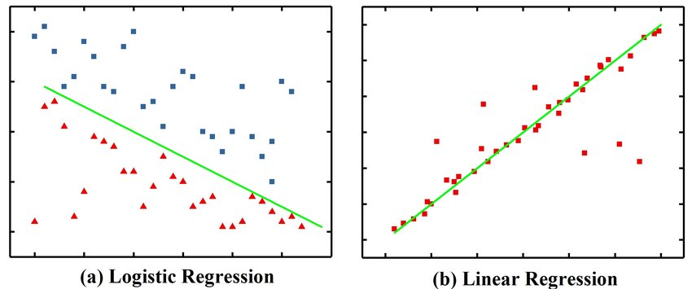

# 线性回归与逻辑回归

可以让用户随机生成一些数据点（规定一定数量的点 设定数据的一些特征） 同时生成拟合的线条

# 深度学习的三大核心层

## 卷积层、池化层和全连接层

可以以动画的形式解释一些卷积和池化的过程 让用户修改卷积核的参数 看到卷积这一过程是怎么进行的

可以部署一个已经训练好的小网络比如lenet 在最后的全连接层输出的时候展示一下每一个分类的概率都是多少 让用户自己选择一些我们给出的图片（比如mnist数据集）

